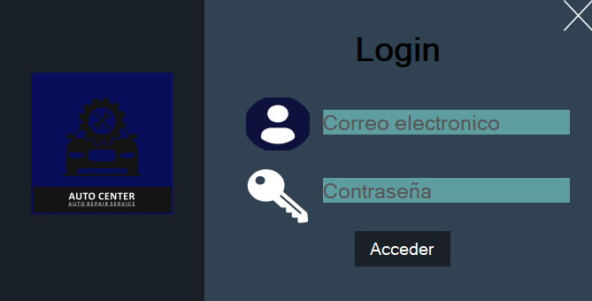

# 🧮 Proyecto - Taller mecánico

Este proyecto es una aplicación para la gestión de un taller mecánico, permitiendo organizar y relacionar información clave sobre dueños de vehículos, mecánicos, vehículos, reparaciones y usuarios del sistema. Su estructura relacional facilita la administración eficiente de servicios de reparación y mantenimiento **en C#**.

Características principales:

- Estructura relacional: La base de datos está compuesta por cinco tablas principales (dueno, vehiculo, mecanico, reparacion, usuario), cada una con claves primarias y relaciones lógicas entre sí.
- Integridad de datos: Uso de claves primarias (AUTO_INCREMENT) para asegurar la unicidad de registros.
- Compatibilidad: Utiliza el motor InnoDB con codificación UTF-8 (utf8mb4) para soportar una amplia variedad de caracteres y asegurar transacciones confiables.

---

## 📷 Captura del Programa

---

## 🛠 Tecnologías usadas

- C# (.NET Framework)
- Windows Forms
- Base de datos MySQL

---

## 🚀 Cómo ejecutar

1. Abre el proyecto con Visual Studio
2. Compila y ejecuta (F5)
3. Debes crear la base de datos con el esquema dado
4. Puedes los Insert, Update, Delete, Select ya en el sistema

---

## ✍️ Autor

- Carlos Alberto Medina Beltran
